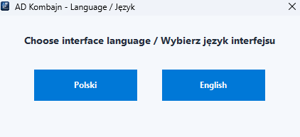
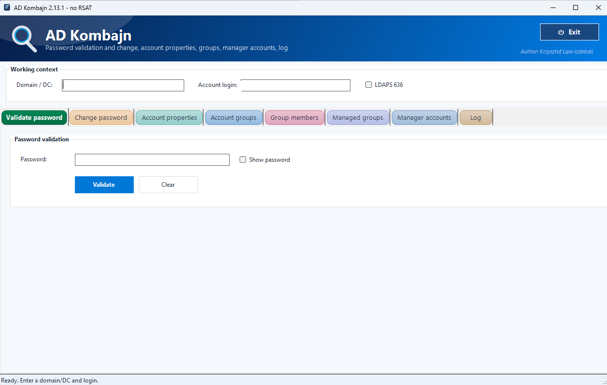

# ADKombajn

A lightweight Windows GUI tool for common Microsoft Active Directory support tasks.

"Kombajn" is a Polish word often used for an all-in-one multi-purpose tool — and that is exactly the idea behind this project.

**ADKombajn is built for application support teams that need quick Active Directory account insight without installing RSAT or using the ActiveDirectory PowerShell module.**

ADKombajn was created to simplify everyday Active Directory support tasks by collecting frequently used account, group and manager-related information in one place.

The application is written in PowerShell and uses a graphical Windows interface.

> The current user interface is available in Polish.

## Features

ADKombajn currently provides:

* Active Directory account lookup by login
* password validation
* password change using LDAP `unicodePwd`
* basic account information
* account status and expiration information
* account properties view
* group membership list
* domain group members view
* accounts assigned to the selected user as manager
* groups managed by the selected user
* operation log displayed directly in the application
* tab-based interface for separating different types of information
* CSV/XLSX export for selected result tables
* copy-friendly output for further analysis or reporting

## Screenshots






More screenshots will be added as the project develops.

## Requirements

* Windows 10, Windows 11 or Windows Server
* Windows PowerShell 5.1
* `ADKombajn.ps1` saved as UTF-8 with BOM
* network access to an Active Directory domain
* permissions required to read the requested Active Directory objects

### Encoding note

ADKombajn targets Windows PowerShell 5.1.  
When editing `ADKombajn.ps1`, save the file as **UTF-8 with BOM**.

Windows PowerShell 5.1 may incorrectly parse UTF-8 files without BOM when the script contains non-ASCII characters, for example Polish UI labels.

To convert the file to UTF-8 with BOM using Windows PowerShell:

```powershell
$path = ".\ADKombajn.ps1"
$fullPath = (Resolve-Path -LiteralPath $path).Path

$text = [System.IO.File]::ReadAllText($fullPath)

$utf8Bom = New-Object System.Text.UTF8Encoding -ArgumentList $true
[System.IO.File]::WriteAllText($fullPath, $text, $utf8Bom)
```

## Running the application

Clone the repository:

```powershell
git clone https://github.com/nachszon/ADKombajn.git
cd ADKombajn
```

Run the main PowerShell script:

```powershell
powershell.exe -ExecutionPolicy Bypass -File .\ADKombajn.ps1
```

Alternatively, start the script from an existing PowerShell session:

```powershell
.\ADKombajn.ps1
```

## Usage

1. Start ADKombajn.
2. Enter the domain or domain controller in the **Domena/DC** field.
3. Enter the account login in the **Login konta** field.
4. Review or run the operation available in the application tabs:

   * password validation
   * password change
   * account properties
   * account group memberships
   * domain group members
   * manager accounts
   * managed groups
   * operation log

The amount of information returned depends on the user's Active Directory permissions.

## Project structure

```text
ADKombajn/
├── ADKombajn.ps1
├── build.ps1
├── kombajn.ico
├── README.md
├── README.pl.md
├── CHANGELOG.md
├── LICENSE
├── docs/
│   └── images/
│       └── adkombajn-main.png
└── src/
```

The `src/` directory is reserved for future modularization of the application code.

The final structure may change as the application is split into separate modules.

## Versioning

The project uses Semantic Versioning:

```text
MAJOR.MINOR.PATCH
```

Example:

```text
2.12.0
```

* **MAJOR** — incompatible changes or a major application redesign
* **MINOR** — new functionality compatible with the current version
* **PATCH** — bug fixes and minor internal improvements

## Security

ADKombajn does not include credentials, passwords or organization-specific configuration.

Before using the application in a production environment:

* review the source code
* verify the configured Active Directory queries
* test the application in a non-production environment
* use an account with the minimum required permissions
* do not commit internal domain names, credentials or confidential data to the repository

Organization-specific modules and internal tools are not included in the public repository.

## Known limitations

* the user interface is currently available only in Polish
* the application currently targets Windows PowerShell 5.1
* functionality depends on .NET Directory Services and LDAP access to Active Directory
* Active Directory permissions may limit the returned results
* the application has currently been tested only in selected domain environments

## Roadmap

Planned improvements may include:

* English user interface
* configurable domain selection
* improved search and filtering
* exporting selected results
* modular PowerShell code structure
* configuration file support
* additional validation and error handling
* signed releases
* standalone executable packages

## Contributing

Bug reports, ideas and pull requests are welcome.

When reporting an issue, include:

* Windows version
* Windows PowerShell version
* ADKombajn version
* steps required to reproduce the problem
* error message with confidential information removed

Do not include real usernames, domain names, distinguished names or other organization-specific data.

## Disclaimer

This project is not affiliated with or endorsed by Microsoft.

The software is provided as-is, without warranty. Always review and test the code before using it in a production Active Directory environment.

## License

This project is licensed under the GNU General Public License v3.0.

See the [LICENSE](LICENSE) file for details.
