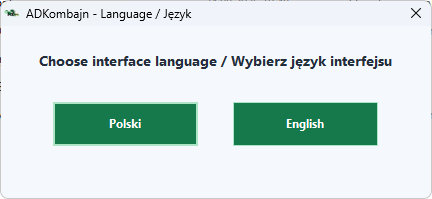
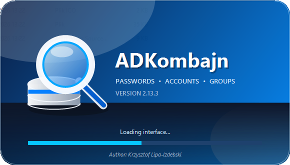
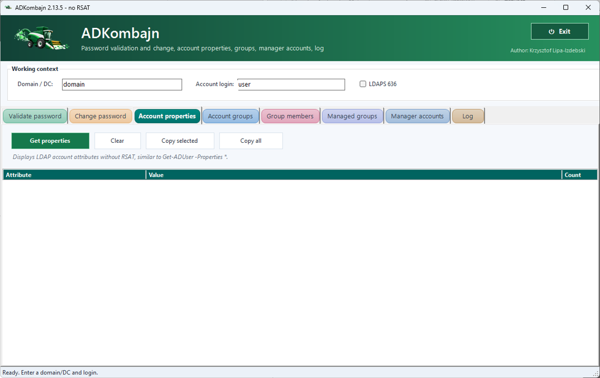
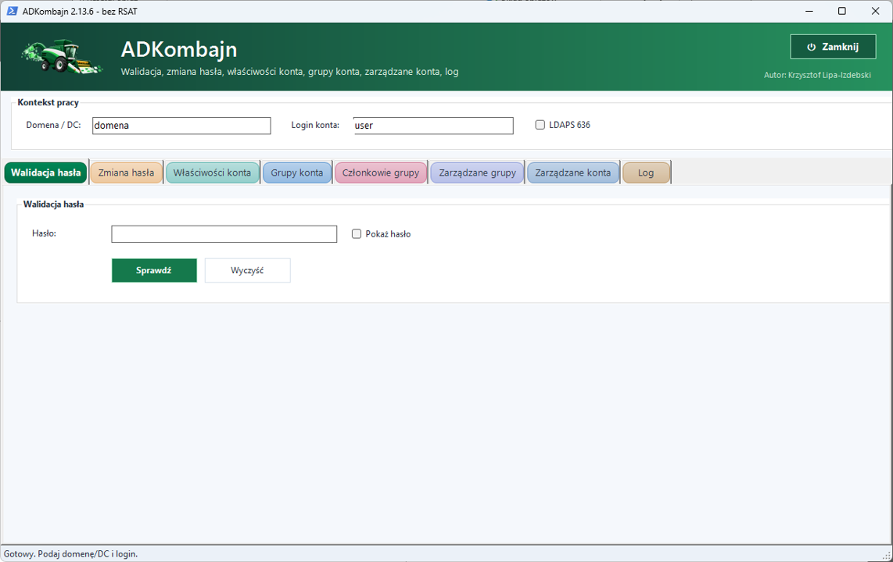

# ADKombajn

A lightweight Windows GUI tool for common Microsoft Active Directory support tasks.

"Kombajn" is a Polish word often used for an all-in-one, multi-purpose tool — and that is exactly the idea behind this project.

**ADKombajn is designed for application support teams that need quick access to Active Directory account and group information without installing RSAT or using the ActiveDirectory PowerShell module.**

The application is written in PowerShell, uses a graphical Windows interface, and is available in Polish and English.

## Features

ADKombajn currently provides:

* Active Directory account lookup by login
* password validation
* password change using the LDAP `unicodePwd` operation
* account status, expiration information, and LDAP properties
* account group membership view
* domain group members view
* accounts assigned to the selected user as manager
* groups managed by the selected user
* filtering and searching of managed account results
* CSV and XLSX export of the currently visible managed account rows
* copy-friendly output for further analysis or reporting
* operation log displayed directly in the application
* Polish and English user interface

ADKombajn uses built-in .NET Directory Services and LDAP APIs. It does not require RSAT or the ActiveDirectory PowerShell module.

## Screenshots









## Download and run

### Ready-to-use executable

The easiest way to use ADKombajn is to download the latest compiled executable from the [Releases](https://github.com/nachszon/ADKombajn/releases) page.

Download the file named:

```text
ADKombajn-<version>-win-x64.exe
```

No installation is required. Download the file and run it on a Windows computer with network access to the Active Directory domain.

> Current release executables are not digitally signed. Windows may therefore display a Microsoft Defender SmartScreen warning. If this occurs, verify that the file was downloaded from this repository's official Releases page before running it.

### Run from source

Clone the repository:

```powershell
git clone https://github.com/nachszon/ADKombajn.git
cd ADKombajn
```

Run the main script with Windows PowerShell 5.1:

```powershell
powershell.exe -ExecutionPolicy Bypass -File .\ADKombajn.ps1
```

Alternatively, start the script from an existing Windows PowerShell session:

```powershell
.\ADKombajn.ps1
```

At startup, ADKombajn displays a Polish/English language selector. To bypass the selector, use the `-Language` parameter:

```powershell
.\ADKombajn.ps1 -Language pl
.\ADKombajn.ps1 -Language en
```

## Requirements

### Ready-to-use executable

* Windows 10, Windows 11, or Windows Server
* network access to an Active Directory domain
* permissions required to read or modify the requested Active Directory objects

### Running from source

* all requirements listed above
* Windows PowerShell 5.1
* `ADKombajn.ps1` saved as UTF-8 with BOM

### Active Directory connectivity

By default, ADKombajn uses LDAP on port 389 with signing and sealing. LDAPS on port 636 can be selected in the application when required by the environment.

Password changes use the current password and the new password. They are performed through the LDAP `unicodePwd` operation and are not administrative password resets.

The available operations and returned information depend on the permissions of the account running ADKombajn and on the Active Directory configuration.

## Usage

1. Start ADKombajn and select Polish or English.
2. Enter the domain name or domain controller in the **Domain/DC** field.
3. If required by the environment, enable **LDAPS 636**.
4. Enter the login in the **Account login** field.
5. Select the appropriate tab and run the required operation:

   * validate a password
   * change a password
   * display account properties
   * display account group memberships
   * display members of a domain group
   * find accounts assigned to a manager
   * find groups managed by an account
   * review the operation log

Managed account results can be filtered, searched, copied, and exported to CSV or XLSX. Exports contain the rows currently visible after applying the filter and search criteria.

## Building the executable

The repository includes `build.ps1`, which compiles `ADKombajn.ps1` with [PS2EXE](https://github.com/MScholtes/PS2EXE).

Before building, make sure that the `Invoke-PS2EXE` command is available in the current Windows PowerShell session.

Build using the version defined by default in `build.ps1`:

```powershell
.\build.ps1
```

Or specify the four-part executable version explicitly:

```powershell
.\build.ps1 -Version "2.13.6.0"
```

The build script:

* verifies that `ADKombajn.ps1` is saved as UTF-8 with BOM
* embeds application metadata and `kombajn.ico`
* creates a windowed executable without a console window
* explicitly targets the x64 architecture
* writes the release asset as `ADKombajn-<version>-win-x64.exe`

Custom input, icon, and output locations can be supplied when needed:

```powershell
.\build.ps1 `
    -InputFile ".\ADKombajn.ps1" `
    -IconFile ".\kombajn.ico" `
    -OutputDirectory ".\dist"
```

### Encoding note

ADKombajn targets Windows PowerShell 5.1. When editing `ADKombajn.ps1`, save the file as **UTF-8 with BOM**.

Windows PowerShell 5.1 may incorrectly parse UTF-8 files without BOM when the script contains non-ASCII characters, such as Polish UI labels.

To convert the file to UTF-8 with BOM using Windows PowerShell:

```powershell
$path = ".\ADKombajn.ps1"
$fullPath = (Resolve-Path -LiteralPath $path).Path
$text = [System.IO.File]::ReadAllText($fullPath)
$utf8Bom = New-Object System.Text.UTF8Encoding -ArgumentList $true
[System.IO.File]::WriteAllText($fullPath, $text, $utf8Bom)
```

## Project structure

```text
ADKombajn/
├── ADKombajn.ps1
├── build.ps1
├── kombajn.ico
├── README.md
├── CHANGELOG.md
├── LICENSE
├── .gitignore
├── docs/
│   └── images/
│       ├── adkombajn-language-selection.png
│       ├── adkombajn-splash-en.png
│       ├── adkombajn-en.png
│       └── adkombajn-main.png
└── src/
```

The `src/` directory is reserved for future modularization. The project structure may change as the application is split into separate modules.

## Versioning

The project uses Semantic Versioning where practical:

```text
MAJOR.MINOR.PATCH
```

For example, release `2.13.6` is built with the four-part Windows executable version `2.13.6.0`.

* **MAJOR** — incompatible changes or a major application redesign
* **MINOR** — new functionality compatible with the current version
* **PATCH** — bug fixes and minor internal improvements

See [CHANGELOG.md](CHANGELOG.md) for release history.

## Security

ADKombajn does not include credentials, passwords, internal domain names, or organization-specific configuration.

Before using the application in a production environment:

* review the source code
* verify the configured Active Directory queries and connection mode
* test the application in a non-production environment
* use an account with the minimum required permissions
* download executable files only from this repository's official Releases page
* do not commit internal domain names, credentials, or confidential data to the repository

Organization-specific modules and internal tools are not included in the public repository.

## Known limitations

* the application currently targets Windows PowerShell 5.1 and Windows environments
* functionality depends on .NET Directory Services and LDAP access to Active Directory
* Active Directory permissions and policies may limit available operations or returned results
* the application has been tested only in selected domain environments
* release executables are not currently digitally signed

## Roadmap

Planned improvements may include:

* configurable domain selection
* improved search and filtering
* modular PowerShell code structure
* configuration file support
* additional validation and error handling
* signed releases

## Contributing

Bug reports, ideas, and pull requests are welcome.

When reporting an issue, include:

* Windows version
* Windows PowerShell version, if running from source
* ADKombajn version
* steps required to reproduce the problem
* the error message with confidential information removed

Do not include real usernames, domain names, distinguished names, passwords, or other organization-specific data.

## Collaboration

Parts of the implementation and documentation were developed with the assistance of ChatGPT, and I don't feel guilty about it 😄

## Disclaimer

This project is not affiliated with or endorsed by Microsoft.

The software is provided as-is, without warranty. Always review and test the code before using it in a production Active Directory environment.

## License

This project is licensed under the GNU General Public License v3.0.

See the [LICENSE](LICENSE) file for details.
